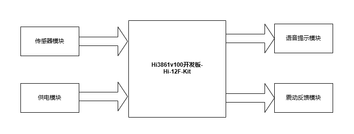
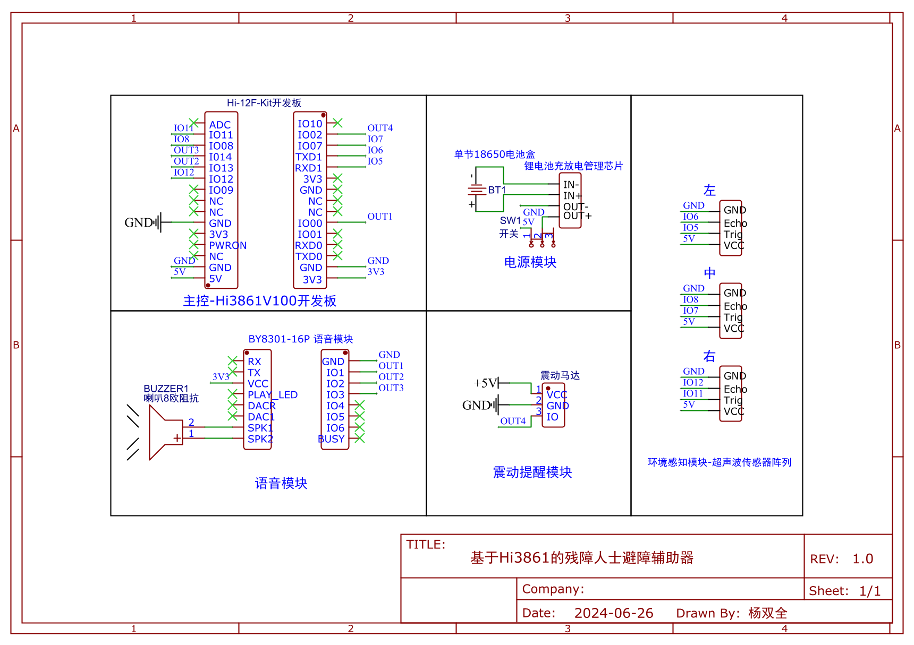
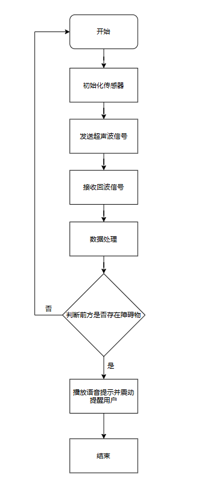

# 2024_hisilicon_embedded_competition-master
 2024_hisilicon_embedded_competition-master
# 残障人士避障辅助器-基于Hi3861的盲人避障辅助器

本项目旨在开发一款基于海思 Hi3861的盲人避障辅助器，通过超声波传感器检测前方障碍物，利用语音提示和震动反馈，帮助盲人用户安全避障。

## 功能特点

- 实时检测前方障碍物距离
- 语音提示障碍物方向和距离
- 震动反馈帮助用户感知障碍物
- 简单易用，携带方便

## 系统组成

## 硬件结构

### 硬件组成部分

- HiSilicon Hi3861开发板
- 超声波传感器模块
- 语音提示模块
- 震动反馈模块
- 电源模块

### 电路原理图

## 软件架构

### 软件模块组成

- 传感器数据采集模块
- 数据处理模块
- 语音提示模块
- 震动反馈模块

### 软件流程图

## 使用说明

1. 打开电源，系统开始初始化
2. 系统启动后，超声波传感器开始检测前方障碍物距离
3. 当检测到障碍物时，系统通过语音和震动提示用户

## 未来扩展

- 增加红外传感器或激光雷达，提升检测精度
- 接入云端，实现远程监控和数据分析
- 增加GPS模块，提供导航功能

## 作者

- 项目负责人：杨双全
- 团队成员：杨瑷玮、林祺锐
## 开源许可

本项目基于MIT开源许可证，详细信息请参见[LICENSE](LICENSE)文件。
